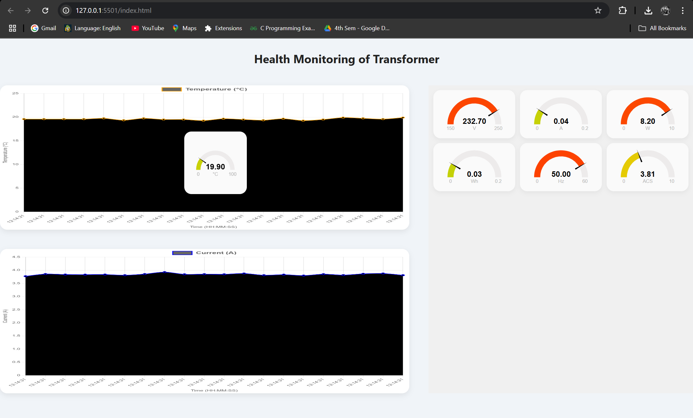
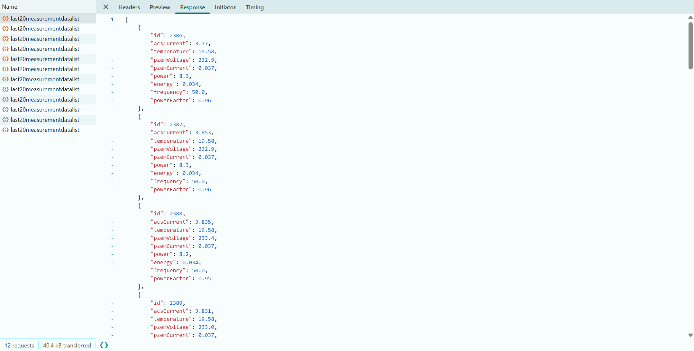
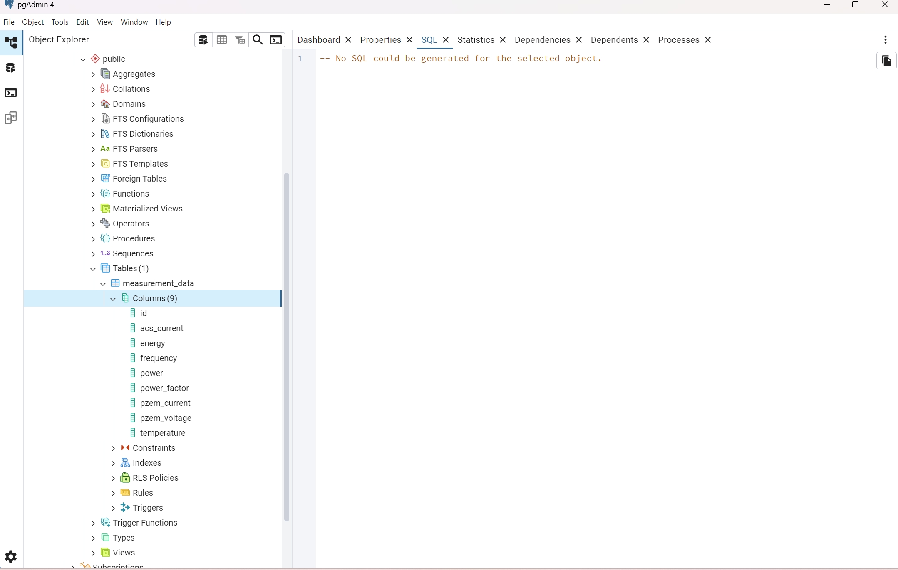
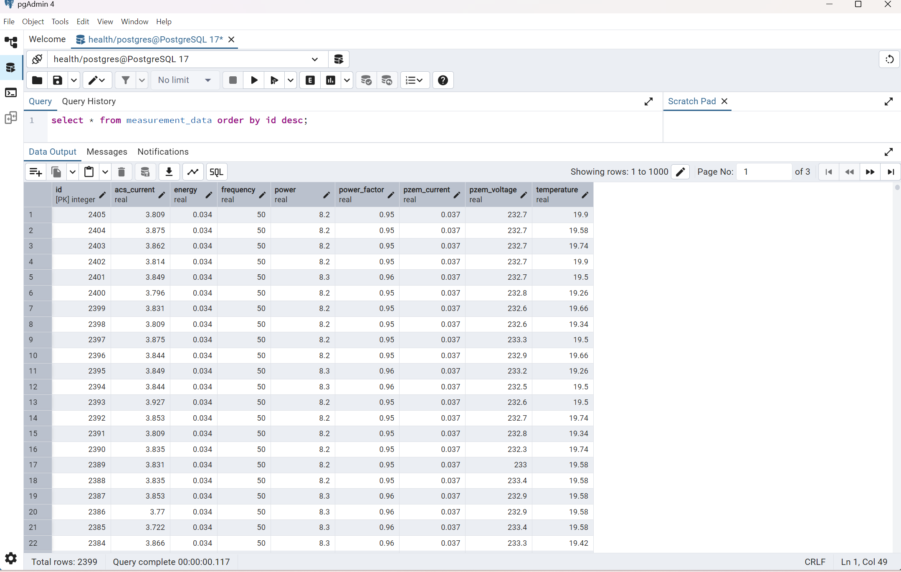

## 📌 Features

- REST API for data ingestion and retrieval
- Support for real-time health parameters (Voltage, Current, Power, Temperature, etc.)
- Data persistence using a relational database PostgreSQL

## 🛠️ Tech Stack

- Java 21
- Spring Boot
- Spring Web
- Spring Data JPA
- PostgreSQL (configurable)
- Lombok (for cleaner code)
- Hibernate

## 🏗️ Project Structure
src/ 
├── main/ 
│ ├── java/ 
│ │ └── com/health/measurement/ 
│ │ ├── controller/ 
│ │ ├── config/  
│ │ ├── model/ 
│ │ ├── repository/ 
│ │ └── service/ 
│ └── resources/ 
│ ├── application.properties 
└── test/ 

## 📡 API Endpoints
| Method | Endpoint                  | Description                 |
| ------ | ------------------------- | --------------------------- |
| POST   | `/measurementdata`        | Submit new sensor data      |
| GET    | `last20measurementdatalist`        | Get the latest 20 measurements |
| GET    | `/measurementdata/{id}`   | Get measurement by ID       |
| GET    | `/measurementdatalist` | Get all measurement records  |

🧪 Sample JSON
<pre>
{
    "id": 2391,
    "acsCurrent": 3.809,
    "temperature": 19.34,
    "pzemVoltage": 232.8,
    "pzemCurrent": 0.037,
    "power": 8.2,
    "energy": 0.034,
    "frequency": 50.0,
    "powerFactor": 0.95
}
</pre>

## UI Screen

## Network tab responses

## Database schema

## Data in postgres 
